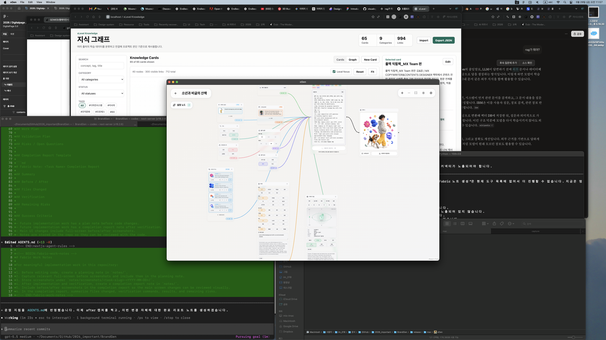

# Fabric Note: Work Planning and Before/After Capture Workflow Completion Report

## Summary

Added a persistent workflow rule for future implementation work:

- create a Fabric-style plan note before implementation
- capture and include full-screen before screenshots
- create a Fabric-style completion report after implementation and verification
- capture and include full-screen after screenshots
- store screenshot evidence with the notes in the repository

## Before / After

### Before

### After

## Files Changed

- `AGENTS.md`
- `notes/fabric-workflow-notes-plan.md`
- `notes/fabric-workflow-notes-completion-report.md`
- `notes/screenshots/fabric-workflow-notes-2026-05-29/before-fullscreen.png`
- `notes/screenshots/fabric-workflow-notes-2026-05-29/after-fullscreen.png`

## Verification

- Confirmed `AGENTS.md` now contains the future-work Fabric note rule.
- Confirmed the planning note exists and includes a before screenshot.
- Confirmed the completion report exists and includes before/after screenshots.
- Confirmed screenshots are stored under `notes/screenshots/fabric-workflow-notes-2026-05-29/`.

## Remaining Risks

- Existing unrelated dirty worktree items remain untouched.
- Full-screen screenshots reflect the current visible desktop state. For future UI-specific work, capture the app's main changed screen as well as the full-screen context.
