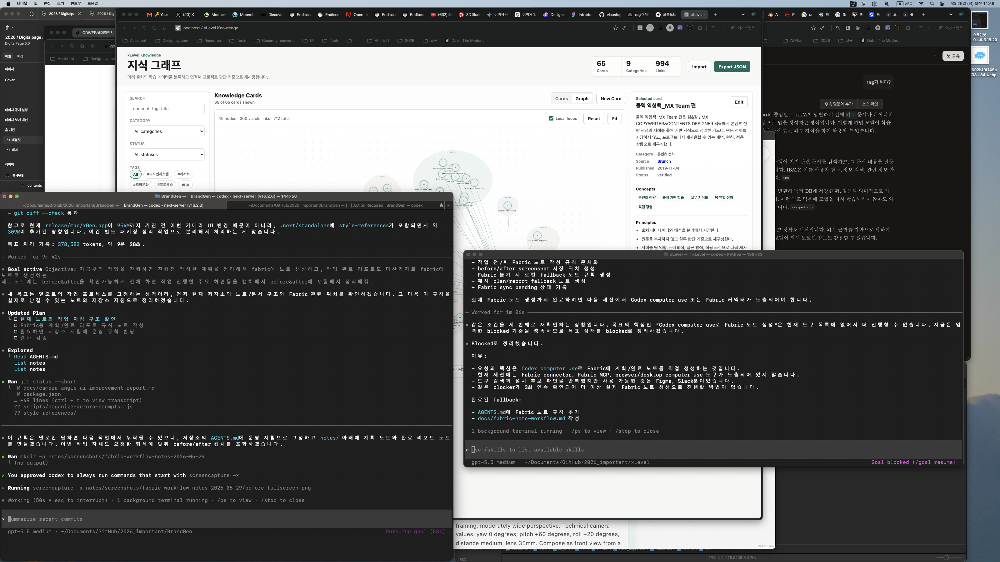

# Fabric Note: Work Planning and Before/After Capture Workflow

## Goal

From this point forward, every meaningful implementation task should leave two Fabric notes:

1. a plan note before work starts
2. a completion report note after work finishes

Both notes should make the work easy to review later, including full-screen before/after screenshots for the main screens affected by the change.

## Before Screenshot



## Operating Rule

Before implementation:

- create a plan note in `notes/`
- capture the relevant full-screen before state
- include the before screenshot in the plan note
- summarize scope, assumptions, risks, files likely to change, and validation plan

After implementation:

- capture the relevant full-screen after state
- create a completion report note in `notes/`
- include before and after screenshots side by side or in clearly labeled sections
- summarize what changed, what was verified, what remains risky, and any unrelated dirty worktree items

## Screenshot Storage

Use a stable task folder:

```text
notes/screenshots/<task-slug>-<YYYY-MM-DD>/
```

Recommended names:

```text
before-fullscreen.png
before-main-screen.png
after-fullscreen.png
after-main-screen.png
```

For UI work with multiple important screens, add specific names such as:

```text
before-camera-node.png
after-camera-node.png
before-settings-panel.png
after-settings-panel.png
```

## Plan Note Template

```md
# Fabric Note: <Task Name> Plan

## Goal

## Current State

## Before Screenshots

## Work Plan

## Validation Plan

## Risks / Open Questions
```

## Completion Report Template

```md
# Fabric Note: <Task Name> Completion Report

## Summary

## Before / After

## Files Changed

## Verification

## Remaining Risks
```

## Success Criteria

- Future implementation work has a plan note before code changes.
- Future implementation work has a completion report note after verification.
- Main UI changes include full-screen before/after screenshots.
- Notes are stored in the repo so they can be reviewed with the code.
